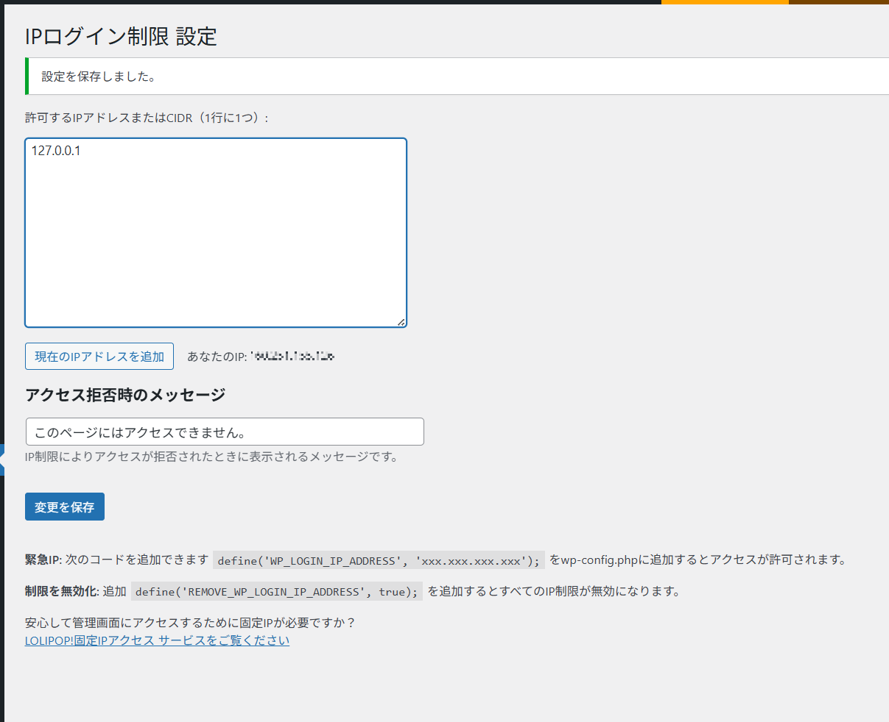

# IP Login Restrictor

WordPress のログイン・管理画面へのアクセスを、特定の IP アドレスまたは CIDR で制限できるプラグインです。

## 主な機能 ✨

- ログイン・管理画面にアクセスできる IP / CIDR を管理画面から設定可能
- `wp-config.php` に緊急許可 IP を設定可能
- IP 制限メッセージのカスタマイズ
- 管理画面から現在の IP をワンクリックで追加可能
- アップデート通知＆自動更新に対応（GitHub連携）
- 日本語対応
- LOLIPOP! 固定IPアクセス サービス案内があるよ（笑）

---

## スクリーンショット



---

## 使用方法 🚀

### 1. プラグインを有効化

通常の手順で有効化してください。

### 2. 許可するIPの登録

- 管理画面 →「IP Login Restrictor（IPログイン制限）」メニューを開く
- IPアドレス または CIDR を1行ずつ入力
- 現在のアクセス元IPをワンクリックで追加することも可能です

### 3. メッセージのカスタマイズ（任意）

アクセス拒否時に表示するメッセージを編集できます。

---

## wp-config.php による設定（任意）

IPアドレスが変更されたりして管理画面にアクセスできなくなった場合、`wp-config.php` に以下の設定を追加することで、特定の IP アドレスからのアクセスを許可できます。

### 緊急アクセスIPの許可

```php
define('WP_LOGIN_IP_ADDRESS', '123.123.123.123');
```

### 全てのIPを許可する場合

```php
define('REMOVE_WP_LOGIN_IP_ADDRESS, true);
```

